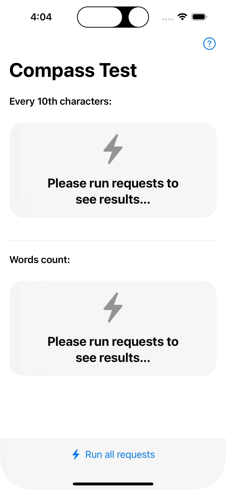
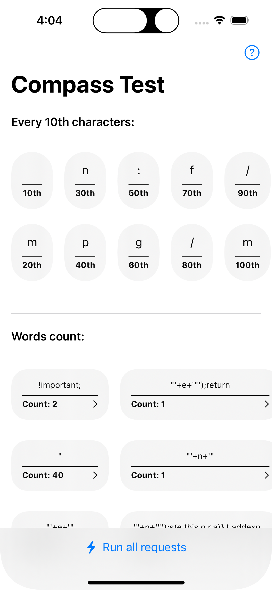
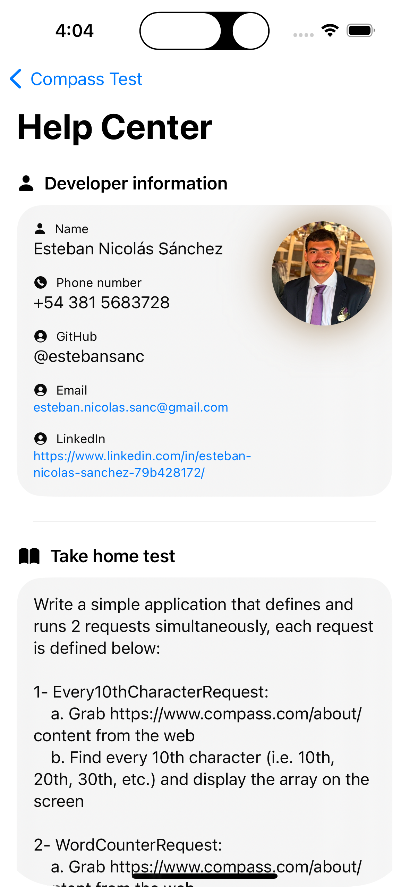
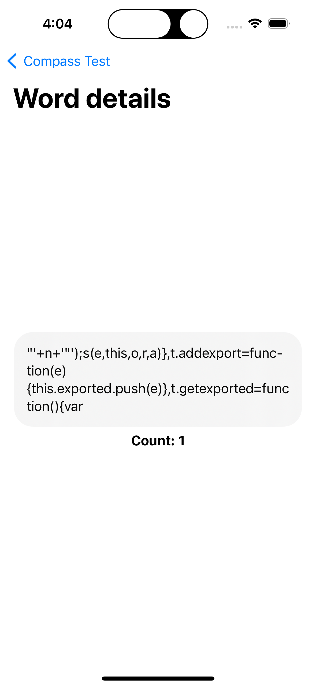

# CompassTakeHomeTest

Welcome to the CompassTakeHomeTest app! This application is developed using the latest technologies to provide a smooth and responsive user experience across multiple Apple platforms.

## Technologies Used

- **Swift 5**: The programming language used for developing the app.
- **SwiftUI**: The modern UI framework for building declarative user interfaces.
- **Supported iOS 17.4**: The app is optimized and tested for iOS 17.4.
- **Combine**: The reactive programming framework used for handling asynchronous events and data streams.

## Supported Platforms

- **iPhone**
- **iPad**
- **Apple Vision**

## About the App

The CompassTakeHomeTest app is a simple application designed to run two requests simultaneously and display the results. The app performs the following tasks:

1. **Every10thCharacterRequest**:
   - Fetches the content from [Compass About Page](https://www.compass.com/about/).
   - Finds every 10th character (i.e., 10th, 20th, 30th, etc.) and displays the array on the screen.

2. **WordCounterRequest**:
   - Fetches the content from [Compass About Page](https://www.compass.com/about/).
   - Splits the text into words using whitespace characters (i.e., space, tab, line break, etc.).
   - Counts the occurrence of every unique word (case insensitive) and displays the count for each word on the screen.

### Features

- **Single Button Execution**: A single button initiates both requests simultaneously.
- **Real-time Results Display**: Results are displayed in respective views representing lists as soon as each request finishes processing.
- **Offline Caching**: Data is cached and made available offline after the first fetch.
- **Unit Tested**: The code is thoroughly unit tested to ensure reliability and correctness.

## Architecture

The application follows the **MVVM (Model-View-ViewModel)** architecture pattern. This pattern helps in separating the concerns of data handling and UI rendering, making the app more modular and testable.

### Design Principles

- **Separation of Concerns**: The app logic is separated into distinct layers to improve maintainability and testability.
- **Reactive Programming**: Using Combine, the app efficiently handles asynchronous data streams.
- **Dependency Injection**: Dependencies are injected to ensure loose coupling between components, enhancing testability.
- **Protocol-Oriented Programming**: Protocols are used to define clear interfaces, making the app flexible and scalable.

## Screens

### Main Screen

The main screen displays the results of the requests made by the app. It consists of two main sections: "Every 10th characters" and "Words count".

#### Main Screen Details

- **Every 10th characters**: Displays every 10th character from the fetched data.
- **Words count**: Displays the count of each unique word from the fetched data.

### Help Center

The Help Center provides detailed information about the developer and the application requirements.

#### Help Center Details

- **Developer Information**: Displays the developer's name, phone number, GitHub, email, and LinkedIn profile.
- **Take Home Test Information**: Displays the requirements and description of the take-home test for this application.

### Word Detail Screen

The Word Detail screen provides detailed information about a selected word from the "Words count" section.

#### Word Detail Screen Details

- **Word**: Displays the selected word.
- **Count**: Displays the count of occurrences of the selected word.

## Contact Information

- **Esteban Nicolás Sánchez**
- **GitHub**: [@estebansanc](https://github.com/estebansanc)
- **Phone**: +54 381 5683728
- **Email**: esteban.nicolas.sanc@gmail.com

Feel free to reach out if you have any questions or need further assistance.

